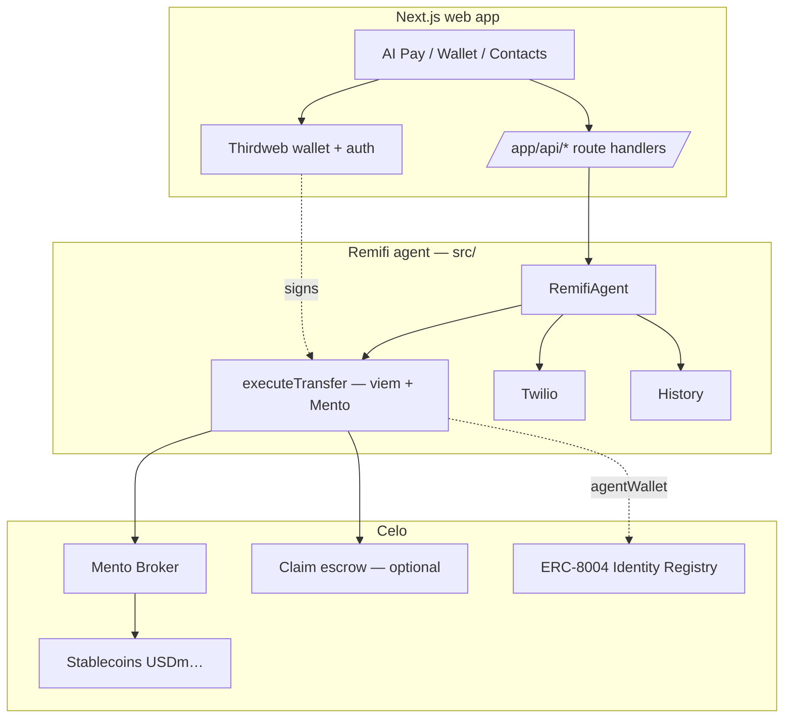
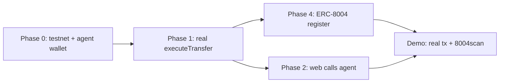

# Remifi — Agent Implementation Plan

What it takes to turn Remifi from a **UI prototype + stubbed agent** into a **functional onchain remittance agent** for the Celo Onchain Agents Hackathon.

> Companion to `howitworks.md` (product flow). This doc is the **build plan**.

---

## Table of contents

1. [Current state audit](#1-current-state-audit)
2. [The core gap](#2-the-core-gap)
3. [Target architecture](#3-target-architecture)
4. [Phased build plan](#4-phased-build-plan)
5. [Phase 0 — Foundations](#phase-0--foundations)
6. [Phase 1 — Real on-chain execution](#phase-1--real-on-chain-execution-agent)
7. [Phase 2 — Web ↔ agent API bridge](#phase-2--web--agent-api-bridge)
8. [Phase 3 — Wallet & auth (Thirdweb)](#phase-3--wallet--auth-thirdweb)
9. [Phase 4 — ERC-8004 + x402 registration](#phase-4--erc-8004--x402-registration)
10. [Phase 5 — Receive flow (claim escrow)](#phase-5--receive-flow-claim-escrow)
11. [Phase 6 — Polish & differentiators](#phase-6--polish--differentiators)
12. [Minimum path to "functional"](#5-minimum-path-to-functional)
13. [Risks & decisions needed](#6-risks--decisions-needed)
14. [File-by-file work list](#7-file-by-file-work-list)

---

## 1. Current state audit

### Agent backend (`src/`) — TypeScript, Node

| Module | File | Status |
|--------|------|--------|
| Intent parser (EN/ES/PT/FR) | `src/intent/parser.ts` | ✅ Works |
| Locale patterns | `src/intent/locales/index.ts` | ✅ Works |
| Mento quote (real SDK) | `src/mento/client.ts` | ✅ Works (read-only quotes) |
| Fee comparison | `src/fees/comparison.ts` | ✅ Works |
| Spending limits | `src/transfers/executor.ts` | ✅ Works |
| Recurring scheduler | `src/transfers/scheduler.ts` | ✅ Works (JSON store) |
| Transaction history | `src/history/store.ts` | ✅ Works (JSON store) |
| Twilio notifications | `src/notifications/twilio.ts` | ✅ Works (needs creds) |
| Agent orchestrator | `src/agent/remitclaw-agent.ts` | ⚠️ Works EXCEPT execution |
| **On-chain execute** | `executeTransfer()` | ❌ **STUBBED** — no real tx |
| CLI: parse, quote | `src/cli/*.ts` | ✅ Works |
| CLI: send | `src/cli/send.ts` | ❌ **Missing** (referenced in SKILL.md) |
| OpenClaw skill | `skills/remifi/SKILL.md`, `openclaw.json` | ✅ Configured |

### Web app (`web/`) — Next.js 16, React 19, Tailwind 4

| Area | Status |
|------|--------|
| Onboarding (3 steps) | ✅ Built |
| Home / Wallet / People / Profile | ✅ Built |
| AI Pay chat | ⚠️ Client-side **regex mock**, no backend call |
| Deposit / Withdraw forms | ⚠️ Mock (no chain) |
| Contacts (localStorage) | ✅ Built |
| Confirmation modals, sheets | ✅ Built |
| Currency/balance toggle | ✅ Built (static data) |
| Auth screen | ❌ Missing |
| Web3 / wallet libs | ❌ None installed |
| API routes (`route.ts`) | ❌ None |
| Real balances | ❌ Static `WALLET_ASSETS` |
| Contact wallet address field | ❌ Missing |

### Smart contracts

| Item | Status |
|------|--------|
| Any `.sol` files | ❌ None |
| Claim escrow / vault | ❌ Not built |

### Summary

- **Agent logic is ~80% done** — only real execution is missing.
- **Web is a polished prototype** — zero blockchain wiring.
- **Web and agent are completely disconnected.**
- **No wallet, no auth, no on-chain tx, no agent registration.**

---

## 2. The core gap

```text
What works:   parse → quote → compare fees → limits → [STUB] → notify → record
What's missing:        ───────────────────────────► REAL ON-CHAIN TX ◄───────
```

**One function blocks everything for the hackathon:**

```350:380:src/agent/remitclaw-agent.ts
async executeTransfer(...) {
  // On-chain execution: wire up Mento swap + wallet client here
  // record.txHash = await executeMentoSwap(...)
  record.status = "confirmed";   // ← fake confirmation, no tx
}
```

The hackathon judges **Most Activity** and **8004scan rank** on **real onchain transactions**. Without execution, Remifi cannot score those tracks.

---

## 3. Target architecture



**Two execution models** (pick per phase):

| Model | Signer | Pros | Cons |
|-------|--------|------|------|
| **A. Agent wallet** | `AGENT_PRIVATE_KEY` (server) | Fastest to ship; agent has its own onchain identity (ERC-8004 fit) | Custodial; funds flow through agent |
| **B. User wallet** | Thirdweb in browser | Non-custodial; better trust | More wiring; mobile signing UX |

**Recommendation:** Ship **Model A first** (agent wallet) to get real txs + ERC-8004 activity fast, then add **Model B** for production UX.

---

## 4. Phased build plan

| Phase | Goal | Unlocks | Est. effort |
|-------|------|---------|-------------|
| 0 | Foundations (env, deps, build) | Clean base | S |
| 1 | Real on-chain execution (agent wallet) | **Real Celo txs** | M |
| 2 | Web ↔ agent API bridge | AI Pay does real sends | M |
| 3 | Thirdweb wallet + auth | Non-custodial UX | M |
| 4 | ERC-8004 + x402 registration | **Hackathon eligibility** | S–M |
| 5 | Receive flow (claim escrow) | Send to phone-only users | L |
| 6 | Polish & differentiators | Stand out | M |

---

## Phase 0 — Foundations

**Goal:** Clean, runnable base for both apps with testnet config.

### Tasks

- [ ] Confirm `npm install` + `npm run build` works in root and `web/`
- [ ] Add **Celo Sepolia testnet** config to `.env` (safer than mainnet for demo)
  - `CELO_RPC_URL=https://forno.celo-sepolia.celo-testnet.org`
  - `CELO_CHAIN_ID=11142220`
- [ ] Fund an **agent test wallet** with testnet CELO + test stablecoins
- [ ] Add `src/cli/send.ts` (missing CLI referenced by SKILL.md)
- [ ] Verify live Mento quote on testnet: `npx tsx src/cli/quote.ts --from USD --to PH --amount 5`

### Acceptance

Quote CLI returns a real tradable route on testnet; both apps build.

---

## Phase 1 — Real on-chain execution (agent)

**Goal:** `executeTransfer()` produces a **real `txHash`** on Celo.

### Tasks

- [ ] Create `src/wallet/client.ts` — viem wallet + public client from `AGENT_PRIVATE_KEY` + `CELO_RPC_URL`
- [ ] Add `executeMentoSwap()` in `src/mento/client.ts`:
  - Approve source token for Mento Broker
  - Call `swapIn` / broker swap with min-out (slippage guard)
  - Return `txHash`
- [ ] Add `transferStablecoin()` — ERC-20 `transfer` to `recipientWallet`
- [ ] Wire both into `executeTransfer()`:
  1. Validate `recipientWallet` present (else throw clear error)
  2. Swap if source ≠ destination token
  3. Transfer to recipient
  4. Set `record.txHash`, `status: "confirmed"`
- [ ] Add balance + allowance checks before send
- [ ] Add slippage / deadline params to config
- [ ] Unit + manual test on Celo Sepolia

### Acceptance

```bash
npx tsx src/cli/send.ts --to 0xRecipient --from USD --to-country PH --amount 1
# → prints real txHash, viewable on Celo Sepolia explorer
```

### Files

- New: `src/wallet/client.ts`, `src/cli/send.ts`
- Edit: `src/mento/client.ts`, `src/agent/remitclaw-agent.ts`, `src/config/index.ts`, `src/types/index.ts` (add slippage)

---

## Phase 2 — Web ↔ agent API bridge

**Goal:** AI Pay in the web app triggers the **real agent**, not a regex mock.

### Decision: where does the agent run?

| Option | How |
|--------|-----|
| **A. Next.js API routes** import `src/` logic | Move/҂share agent code into a package the web app can import, or call as subprocess |
| **B. Standalone agent service** (Express/Fastify) | Web calls `POST /api/transfer`; agent service runs separately |
| **C. OpenClaw gateway** as the backend | Web posts to OpenClaw; agent skill handles it |

**Recommendation:** **B (standalone service)** — cleanest separation, reuses `RemifiAgent` directly, easy to deploy.

### Tasks

- [x] Create agent HTTP service (`src/server.ts`) exposing:
  - `POST /api/intent` → parse + quote + fee comparison (no execution)
  - `POST /api/transfer` → execute (with confirm token)
  - `GET /api/history` → transactions
  - `GET /api/balance?address=` → live balances
  - `GET /api/agent` → agent wallet address (Model A) for demo balances
  - `GET /api/health` → readiness probe
- [x] Add CORS + simple auth (API key) for the web app
- [x] In `web/`, replace `parseIntent` mock in `PayChat.tsx` with `fetch` to `/api/intent`
- [x] Show **real quote + fee savings** in chat from API response
- [x] On confirm, call `/api/transfer`, show real `txHash` + explorer link
- [x] Replace static `WALLET_ASSETS` with `/api/balance` data (`web/app/components/WalletAssets.tsx`)
- [x] Add env `NEXT_PUBLIC_AGENT_API_URL` in `web/` (`web/.env.local.example`)

### Acceptance

Typing "Send $1 to Mom" in the web AI Pay returns a **live Mento quote**, and confirming produces a **real txHash** shown in the chat.

### Files

- New: `src/server.ts`, `web/app/lib/api.ts`
- Edit: `web/app/components/PayChat.tsx`, `web/app/components/BalanceAmount.tsx`, `web/app/wallet/page.tsx`

---

## Phase 3 — Wallet & auth (Thirdweb)

**Goal:** Users sign in and get a real Celo wallet; sends become non-custodial (Model B).

### Tasks

- [x] Install `thirdweb` in `web/` (`thirdweb@^5.120.0`)
- [x] Add `ThirdwebProvider` in layout (via `web/app/components/Providers.tsx`) with Celo chain config (`web/app/lib/thirdweb.ts`)
- [x] Create `/auth` screen (after onboarding):
  - Email / social login → embedded wallet (`inAppWallet`)
  - Connect external wallet (Valora, MetaMask, WalletConnect)
- [x] Route onboarding final CTA → `/auth` → `/home` (auto-redirect on connect)
- [x] Persist session; show connected `0x` in Profile (thirdweb auto-connect + `ProfileWalletCard`)
- [x] Read **real balances** from connected wallet (`WalletAssets` prefers connected address, falls back to agent wallet)
- [ ] For sends: build tx in agent, **sign in browser** with Thirdweb, broadcast — **deferred** (Model B follow-up; sends still use agent wallet / Model A)
- [ ] Optional: enable **gas sponsorship** (smart account) so users need no CELO — `inAppWallet` `executionMode` is ready to enable

### Acceptance

User logs in with email, sees their real Celo balance, and signs a transfer from their own wallet.
✅ Login + embedded/external wallet + real balance done. ⏳ Browser-signed transfers (Model B) deferred — execution currently runs on the agent wallet.

### Files

- New: `web/app/auth/page.tsx`, `web/app/components/AuthFlow.tsx`, `web/app/components/ConnectWallet.tsx`, `web/app/components/Providers.tsx`, `web/app/components/ProfileWalletCard.tsx`, `web/app/context/WalletContext.tsx`, `web/app/lib/thirdweb.ts`
- Edit: `web/app/layout.tsx`, `web/app/components/OnboardingFlow.tsx`, `web/app/profile/page.tsx`, `web/app/components/WalletAssets.tsx`, `web/.env.example`

---

## Phase 4 — ERC-8004 + x402 registration

**Goal:** Remifi is a registered onchain agent — required for hackathon eligibility & 8004scan.

### ERC-8004 (Celo Identity Registry)

- [x] Write **agent registration JSON** — Celo `endpoints[]` + EIP `services[]`, `x402Support: true`, wallet endpoint (`src/agent/agent-card.ts`)
- [x] Host registration file at `/.well-known/agent.json` (agent API + `web/public/.well-known/agent.json`)
- [x] Create `src/agent/register.ts` — `register(agentURI)` on Identity Registry → mint `agentId`
- [x] Chain-aware registry addresses (mainnet vs Celo Sepolia per docs.celo.org)
- [x] `npm run register` CLI (`src/cli/register.ts`) — dry-run + on-chain mint
- [x] Save `agentId` to config / `.env` (`AGENT_ID`)
- [ ] Verify agent appears on **8004scan** (run register on testnet/mainnet)

> **Note:** `setAgentWallet` EIP-712 proof is **not required** for Model A — the registering wallet (`AGENT_PRIVATE_KEY`) is auto-set as `agentWallet` on mint.

### x402 (Thirdweb payment protocol)

- [x] x402-gated `/api/x402/premium-quote` (402 → `X-PAYMENT` / `PAYMENT-SIGNATURE` → settle)
- [x] thirdweb `settlePayment` + facilitator when `THIRDWEB_SECRET_KEY` is set
- [x] Advertise x402 endpoint in registration JSON (`type: "x402"`)
- [x] `src/agent/reputation.ts` — `giveFeedback()` wrapper for Reputation Registry
- [ ] Optional: charge per transfer via x402 (currently demo on premium-quote only)

### Acceptance

`agentId` minted on Celo; visible on 8004scan; registration JSON advertises endpoints + x402.

### Files

- New: `src/agent/register.ts`, `src/agent/agent-card.ts`, `src/agent/registry-addresses.ts`, `src/agent/reputation.ts`, `src/x402/handler.ts`, `src/cli/register.ts`, `web/public/.well-known/agent.json`
- Edit: `src/server.ts`, `src/config/index.ts`, `.env.example`, `package.json`

---

## Phase 5 — Receive flow (claim escrow)

**Goal:** Send to recipients who have **no wallet** (phone-only) — the real remittance unlock.

### Tasks

- [ ] Write `RemifiEscrow.sol`:
  - `deposit(bytes32 claimHash, address token, uint256 amount)` — sender locks funds
  - `claim(bytes32 secret, address recipient)` — recipient withdraws to new wallet
  - `refund(...)` — sender reclaims if unclaimed after expiry
- [ ] Deploy to Celo Sepolia → mainnet
- [ ] Agent: if contact has phone but no wallet → deposit to escrow + generate claim link
- [ ] Twilio: send claim link in SMS/WhatsApp
- [ ] Web: `/claim/[code]` page → Thirdweb wallet create → `claim()`
- [ ] Add contract address to config

### Acceptance

Sender sends to a phone-only contact; recipient opens SMS link, creates wallet, claims funds — all on testnet.

### Files

- New: `contracts/RemifiEscrow.sol`, `web/app/claim/[code]/page.tsx`, `src/escrow/client.ts`
- Edit: `src/agent/remitclaw-agent.ts`, `src/notifications/twilio.ts`

---

## Phase 6 — Polish & differentiators

**Goal:** Stand out and solve real problems.

- [x] **Contact wallet field + QR scan** — `AddContactForm` + `QrScanner` (camera + paste)
- [x] **Real-time FX rate display** in AI Pay — `FxRateBanner` from live Mento `exchangeRate`
- [x] **Rate alerts** — localStorage alerts + in-chat hit notification (`RateAlertsPanel`, `RateAlertSheet`)
- [x] **Recurring transfer UI** — `RecurringSchedules` on wallet + `/api/schedules` CRUD
- [x] **Transaction receipts** — `TxReceiptShare` (explorer link + Web Share / copy)
- [x] **OpenClaw on WhatsApp** — enabled in `openclaw.json` (needs gateway + Twilio live)
- [x] **Off-ramp stub** — `OffRampPartners` on withdraw (GCash, M-Pesa, Pix — coming soon)
- [x] **Voice input** — mic in `PayChat` via Web Speech API (`speech.ts`)
- [x] **Deposit / Withdraw** — real deposit QR (`DepositContent`); withdraw + off-ramp stub (`WithdrawContent`)
- [x] **Gas sponsorship** — `inAppWallet` `smartAccount.sponsorGas` in `ConnectWallet`
- [ ] **Browser-signed transfers (Model B)** — still deferred; sends use agent wallet

---

## 5. Minimum path to "functional"

If time is short, this is the **critical path** to a working hackathon demo with real onchain activity:



**Must-have for submission:**

1. ✅ **Phase 1** — real `executeTransfer` (agent wallet, Model A)
2. ✅ **Phase 4** — ERC-8004 registration + 8004scan activity
3. ✅ **Phase 2** — web AI Pay triggers a real send (even if agent-signed)

**Nice-to-have:** Phase 3 (Thirdweb), Phase 5 (claim escrow), Phase 6 (polish).

> Agent-wallet model (A) lets you skip Thirdweb for the MVP and still generate **real onchain transactions** that judges can verify.

---

## 6. Risks & decisions needed

| Decision | Options | Recommendation |
|----------|---------|----------------|
| **Signing model for MVP** | Agent wallet vs user wallet | **Agent wallet** (fastest real txs) |
| **Network for demo** | Mainnet vs Celo Sepolia | **Sepolia** first, mainnet for final activity |
| **Agent hosting** | Next.js API vs standalone service vs OpenClaw | **Standalone service** (reuse `RemifiAgent`) |
| **Recipient without wallet** | Escrow vs require address vs off-ramp | **Require address for MVP**, escrow in Phase 5 |
| **Mento mainnet token addresses** | Some are placeholders in code | Verify against live Mento token list before mainnet |

### Open questions for you

1. **Custodial OK for demo?** Agent wallet holds/sends funds — fine for hackathon, but confirm.
2. **Mainnet budget?** Real activity needs real (small) value on Celo mainnet for "Most Activity" track.
3. **Domain for agent registration?** Need a public URL or IPFS for the ERC-8004 `agentURI`.
4. **Which corridors to demo?** USD→PH is wired; confirm focus corridor.

---

## 7. File-by-file work list

### Agent (`src/`)

| File | Action |
|------|--------|
| `src/wallet/client.ts` | **New** — viem wallet/public client |
| `src/mento/client.ts` | **Edit** — add `executeMentoSwap`, approvals |
| `src/agent/remitclaw-agent.ts` | **Edit** — wire real execution |
| `src/cli/send.ts` | **New** — send CLI |
| `src/server.ts` | **New** — HTTP API for web |
| `src/agent/register.ts` | **New** — ERC-8004 registration |
| `src/x402/handler.ts` | **New** — x402 payments |
| `src/escrow/client.ts` | **New** — claim escrow client (Phase 5) |
| `src/config/index.ts` | **Edit** — slippage, agentId, escrow addr, x402 |
| `src/types/index.ts` | **Edit** — execution params |

### Web (`web/`)

| File | Action |
|------|--------|
| `web/app/lib/api.ts` | **New** — agent API client |
| `web/app/components/PayChat.tsx` | **Edit** — call real API, show txHash |
| `web/app/auth/page.tsx` | **New** — Thirdweb auth |
| `web/app/components/ConnectWallet.tsx` | **New** |
| `web/app/context/WalletContext.tsx` | **New** |
| `web/app/claim/[code]/page.tsx` | **New** — claim flow (Phase 5) |
| `web/app/layout.tsx` | **Edit** — ThirdwebProvider |
| `web/app/components/OnboardingFlow.tsx` | **Edit** — route to /auth |
| `web/app/components/BalanceAmount.tsx` | **Edit** — real balances |
| `web/app/wallet/page.tsx` | **Edit** — real assets/history |
| `web/app/components/AddContactForm.tsx` | **Edit** — wallet address + QR |

### Contracts

| File | Action |
|------|--------|
| `contracts/RemifiEscrow.sol` | **New** (Phase 5) |
| Hardhat/Foundry setup | **New** (Phase 5) |

### Config / infra

| File | Action |
|------|--------|
| `.env.example` | **Edit** — testnet, agentId, escrow, x402, API key |
| `public/.well-known/agent.json` | **New** — ERC-8004 registration file |
| `openclaw.json` | **Edit** — enable WhatsApp (Phase 6) |

---

## Suggested order of work (next 5 actions)

1. **Phase 0** — testnet `.env` + fund agent wallet + add `src/cli/send.ts`
2. **Phase 1** — wire `executeTransfer` with viem + Mento swap (get first real txHash)
3. **Phase 4** — register agent on ERC-8004, confirm on 8004scan
4. **Phase 2** — standalone agent API + connect web AI Pay
5. **Phase 3+** — Thirdweb auth, then claim escrow & polish

---

*Remifi — build plan. Pairs with `howitworks.md`. Celo Onchain Agents Hackathon 2026.*
