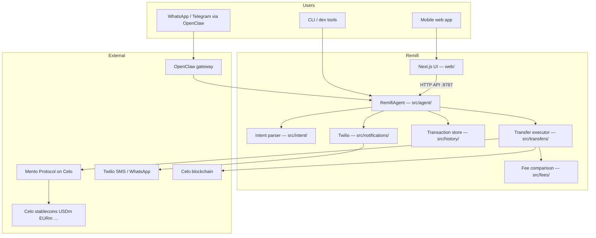
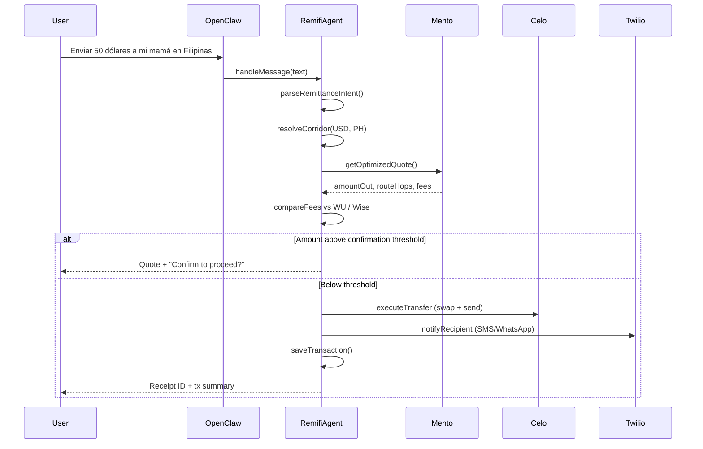
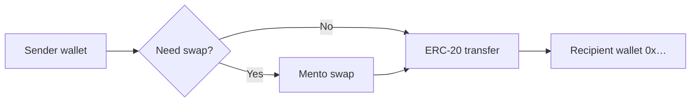
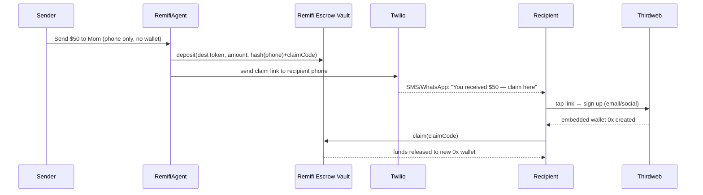

# Remifi — How It Works

A step-by-step guide to the product vision, user flows, on-chain architecture, and hackathon strategy for **Remifi**: a **multilingual** AI remittance agent on Celo that turns natural language into cross-border stablecoin transfers via Mento — in English, Spanish, Portuguese, and French.

---

## Table of contents

1. [What Remifi is](#1-what-remifi-is)
2. [The problem we solve](#2-the-problem-we-solve)
3. [Hackathon alignment](#3-hackathon-alignment)
4. [System architecture](#4-system-architecture)
5. [End-to-end user journey (web app)](#5-end-to-end-user-journey-web-app)
6. [End-to-end agent journey (OpenClaw)](#6-end-to-end-agent-journey-openclaw)
7. [Step-by-step transfer pipeline](#7-step-by-step-transfer-pipeline)
8. [Contacts: adding people who may not have wallets](#8-contacts-adding-people-who-may-not-have-wallets)
9. [On-chain: what receives the money](#9-on-chain-what-receives-the-money)
10. [Integrations in detail](#10-integrations-in-detail)
11. [Security, limits, and confirmations](#11-security-limits-and-confirmations)
12. [Multi-language support](#12-multi-language-support)
13. [Recurring transfers and notifications](#13-recurring-transfers-and-notifications)
14. [Project structure](#14-project-structure)
15. [What is built today vs roadmap](#15-what-is-built-today-vs-roadmap)
16. [Demo and submission checklist](#16-demo-and-submission-checklist)

---

## 1. What Remifi is

**Remifi** is a **multilingual** AI-powered remittance agent for Celo. Users say things like — in any supported language:

- *"Send $50 to my mom in the Philippines"* (English)
- *"Enviar 50 dólares a mi mamá en Filipinas"* (Spanish)
- *"Transferir 100 euros para meu irmão na Nigéria todo mês"* (Portuguese)
- *"Envoyer 50 euros à mon frère au Nigeria"* (French)

The agent:

1. **Understands** the request in EN / ES / PT / FR (amount, currency, destination, schedule, recipient) — locale auto-detected via `src/intent/locales/`.
2. **Routes** the transfer through **Mento Protocol** stablecoin pools on Celo.
3. **Compares fees** against Western Union and Wise so users see savings.
4. **Executes** the on-chain swap and transfer (when wired).
5. **Notifies** the recipient via SMS/WhatsApp.
6. **Records** history, receipts, and enforces spending limits.

Think **bankrbot**, but optimized for remittances on Celo — mobile-first, stablecoin-native, and globally accessible.

---

## 2. The problem we solve

| Traditional remittance | Remifi |
|------------------------|-----------|
| High fees (4–8%+ via Western Union) | Mento routes + low Celo gas |
| Slow settlement (hours to days) | Near-instant on-chain settlement |
| Complex forms and FX jargon | Natural language + AI Pay chat (EN / ES / PT / FR) |
| Opaque exchange rates | Fee comparison before send |
| Requires bank branches | Mobile wallet + global corridors |

Celo is built for real-world payments: fast, low-cost, stablecoin-native, with **15M+ MiniPay users** as potential distribution. Remifi sits on that rail and adds an **agent layer** so sending money feels like sending a message.

---

## 3. Hackathon alignment

**Event:** Onchain Agents Hackathon — Build for Real World Payments & Everyday Applications (May 22 – June 15, 2026)

**Prize tracks Remifi targets:**

| Track | How Remifi qualifies |
|-------|-------------------------|
| **Best Agent on Celo** | OpenClaw agent + Mento execution + real utility (remittance) |
| **Most Activity** | Every confirmed transfer = on-chain tx on Celo |
| **8004scan rank** | Register agent wallet via **ERC-8004**; activity visible on 8004scan |

**Recommended ecosystem stack for submission:**

| Resource | Role in Remifi |
|----------|-------------------|
| **OpenClaw** | Agent framework: NLU, memory, channels (WhatsApp, Telegram) |
| **Mento Protocol** | Multi-currency swaps (USDm, EURm, BRLm, COPm, XOFm) |
| **Celo stablecoins** | Settlement asset on Celo L2 |
| **Twilio / WhatsApp** | Recipient receipts and recurring reminders |
| **Thirdweb** (planned) | User auth + embedded wallets + optional x402 payments |
| **ERC-8004** | Onchain agent identity / wallet standard |
| **Self Agent ID** | Verified agent credentials (where supported) |
| **8004scan** | Public proof of onchain agent activity |

**What judges want:** agents that go beyond prototypes — **real transactions**, **genuine utility**, **consistent onchain activity**.

---

## 4. System architecture



### Two surfaces, one brain

| Surface | Purpose | Status |
|---------|---------|--------|
| **`web/`** | Mobile-first UI: onboarding, wallet, contacts, AI Pay chat | ✅ Wired to agent API (`/api/intent`, `/api/transfer`, balances, history) |
| **`src/`** | Agent core: parse, quote, execute, notify, history | Parser, Mento quotes, fees, limits, **on-chain execution** built; escrow vault planned |
| **OpenClaw** | Conversational agent on messaging channels | Configured via `openclaw.json` + `skills/remifi/SKILL.md` |

---

## 5. End-to-end user journey (web app)

### Phase A — Discovery and setup

| Step | Screen | What happens |
|------|--------|--------------|
| 1 | **Onboarding** (`/`) | 3-step intro: Send crypto simply → AI Pay → Add people |
| 2 | **Auth** (`/auth`) | Thirdweb: email / social / connect wallet on Celo |
| 3 | **Home** (`/home`) | Balance, deposit/withdraw/send actions, favourites |

### Phase B — Build your recipient list

| Step | Action | What happens |
|------|--------|--------------|
| 4 | Tap **+ Add** on Favourites | Bottom sheet opens (`AddContactSheet`) |
| 5 | Fill form | Name (required), country (corridor), phone (optional), wallet `0x` (optional), favourite |
| 6 | Save contact | Stored in browser `localStorage` via `ContactsContext` |
| 7 | Confirmation modal | “Contact saved” — no blockchain yet |

**Important:** Adding a contact does **not** require the recipient to have a Remifi account. You are saving **your** address book entry.

### Phase C — Send money (AI Pay)

| Step | Screen | What happens |
|------|--------|--------------|
| 8 | Open **AI Pay** (`/pay`) | Chat UI with Remifi assistant |
| 9 | User types or taps quick reply | Any supported language, e.g. *"Send $50 to Mom in the Philippines"* or *"Enviar 50 dólares a Mamá en Filipinas"* |
| 10 | Message sent to agent API | `POST /api/intent` — parse + live Mento quote; contact country/wallet passed |
| 11 | Bot replies with route summary | Mento pair, recipient receives, fees, savings vs WU/Wise |
| 12 | User taps **Confirm** | Confirmation modal: amount, recipient, corridor |
| 13 | Success | `POST /api/transfer` → real `txHash`; history + balances refresh from API |

### Phase D — Wallet and history

| Step | Screen | What happens |
|------|--------|--------------|
| 14 | **Wallet** (`/wallet`) | Live balances + recent txs from agent API (`/api/balance`, `/api/history`) |
| 15 | **Deposit / Withdraw** | Forms with confirmation modals (demo flows) |
| 16 | **Profile** | Account info, settings |

---

## 6. End-to-end agent journey (OpenClaw)

When a user messages the agent on WhatsApp, Telegram, or the OpenClaw gateway:



### OpenClaw setup

1. Install OpenClaw and run `openclaw onboard`.
2. Start gateway: `openclaw gateway start`.
3. Repo `openclaw.json` registers the **remifi** skill.
4. Skill doc: `skills/remifi/SKILL.md` defines workflow and safety rules — agent calls `npm run remifi` for live quotes and sends.

---

## 7. Step-by-step transfer pipeline

Every transfer — whether from chat, CLI, or web API — follows the same pipeline.

### Step 1 — Parse natural language intent

**Module:** `src/intent/parser.ts` + `src/intent/locales/`

Input examples (locale auto-detected):

```text
Send $50 to my mom in the Philippines          → en
Enviar 50 dólares a mi mamá en Filipinas      → es
Transferir 100 euros para meu irmão na Nigéria todo mês → pt
Envoyer 50 euros à mon frère au Nigeria       → fr
```

Output (`RemittanceIntent`) for the English example:

```json
{
  "locale": "en",
  "amount": 50,
  "sourceCurrency": "USD",
  "destinationCountry": "PH",
  "recipientName": "mom",
  "frequency": "once",
  "rawMessage": "..."
}
```

Optional fields (when available):

- `recipientPhone` — for Twilio notification
- `recipientWallet` — `0x` address for direct on-chain delivery

**CLI:**

```bash
npx tsx src/cli/parse-intent.ts "Send $50 to my mom in the Philippines"
```

---

### Step 2 — Resolve remittance corridor

**Module:** `src/mento/client.ts` + `data/corridors.json`

Maps source currency + destination country → Mento token pair:

| Corridor | Source | Destination | Mento pair |
|----------|--------|-------------|------------|
| `usd-php` | USD | Philippines (PH) | USDm → PHP |
| `eur-ngn` | EUR | Nigeria (NG) | EURm → NGN |
| `gbp-kes` | GBP | Kenya (KE) | GBP → KES |

Stablecoin contract addresses (Celo mainnet examples):

- **USDm:** `0x765DE816845861e75A25fCA122bb6898B8B1282a`
- **EURm:** `0x10c826A163F5c566a514aFC6a0a7CA779128f0e0`
- **BRLm:** `0xE918F7BB3D25d8936De17cCF579613649F1E5974`

---

### Step 3 — Get Mento route quote

**Module:** `src/mento/client.ts` (`getOptimizedQuote`)

1. Connect to Celo via `@mento-protocol/mento-sdk`.
2. Check if pair is tradable (`isPairTradable`).
3. Find route (`findRoute`) — number of hops.
4. Quote output amount (`getAmountOut`).
5. Estimate Mento fee and gas.

Returns `RouteQuote`: `amountIn`, `amountOut`, `routeHops`, `mentoFeeUsd`, `tradable`.

**CLI:**

```bash
npx tsx src/cli/quote.ts --from USD --to PH --amount 50
```

---

### Step 4 — Compare fees vs traditional providers

**Module:** `src/fees/comparison.ts`

Builds a comparison table:

| Provider | Fee | Recipient receives |
|----------|-----|-------------------|
| **Mento / Remifi** | ~0.1% + gas | Highest (demo) |
| **Western Union** | ~4.5% | Lower |
| **Wise** | ~1.2% | Middle |

Agent surfaces savings message before user confirms.

---

### Step 5 — Validate spending limits

**Module:** `src/transfers/executor.ts`

| Limit | Default (`.env`) |
|-------|------------------|
| Single transfer max | `$200` (`SINGLE_TRANSFER_LIMIT_USD`) |
| Daily total max | `$500` (`DAILY_TRANSFER_LIMIT_USD`) |
| Confirmation required above | `$100` (`REQUIRE_CONFIRMATION_ABOVE_USD`) |

Daily spent is computed from `data/transactions.json` for the current UTC day.

---

### Step 6 — User confirmation (if required)

If `amount >= REQUIRE_CONFIRMATION_ABOVE_USD`:

- Agent **does not** execute immediately.
- Returns quote + fee comparison + explicit confirm prompt.
- User must confirm in chat (OpenClaw) or modal (web).

This prevents accidental large sends and satisfies security requirements in the skill doc.

---

### Step 7 — Execute on-chain (swap + transfer)

**Module:** `src/agent/remitclaw-agent.ts` (RemifiAgent) → `src/transfers/onchain.ts` (`executeTransfer`)

**Planned execution sequence:**



1. **Approve** stablecoin spend (if needed).
2. **Swap** via Mento if source token ≠ destination token for corridor.
3. **Transfer** USDm (or destination stablecoin) to `recipientWallet`.
4. **Record** `txHash` on the transfer record.

**Signer options:**

| Model | Who signs | Vault needed? |
|-------|-----------|---------------|
| **Non-custodial (target UX)** | User wallet via Thirdweb | No — send to recipient `0x` |
| **Agent wallet (MVP)** | `AGENT_PRIVATE_KEY` on server | No — but custodial |
| **Claim-by-phone** | Agent deposits to escrow; recipient claims after Thirdweb signup | Yes — `RemifiVault` |

**Current status:** on-chain execution is **wired** (`src/transfers/onchain.ts`): same-token sends do a direct ERC-20 transfer; cross-currency sends route a Mento swap straight to the recipient. The agent wallet (`AGENT_PRIVATE_KEY`) signs via viem and a real `txHash` is recorded. Remaining: deploy the `RemifiVault` escrow contract for the phone-only claim flow.

---

### Step 8 — Notify recipient

**Module:** `src/notifications/twilio.ts`

If `recipientPhone` is set and Twilio is configured:

```text
You received 50 USD via Remifi.
From: [sender name]
Tx: 0x1234abcd…5678
```

Channels: SMS or WhatsApp (`TWILIO_WHATSAPP_FROM`).

Phone does **not** receive crypto directly. It receives either:

- a **receipt** (recipient already had a wallet — funds already delivered), or
- a **claim link** (recipient had no account — funds wait in the escrow vault until they sign up via Thirdweb and claim).

---

### Step 9 — Persist history and receipt

**Module:** `src/history/store.ts`

Each transfer → `data/transactions.json`:

```json
{
  "id": "uuid",
  "intent": { "...": "..." },
  "txHash": "0x…",
  "status": "confirmed",
  "createdAt": "2026-06-07T…",
  "feeComparison": [ "..."]
}
```

Supports receipts, daily limit tracking, and future web history UI.

---

## 8. Contacts: adding people who may not have wallets

### What “Add contact” stores today

| Field | Required | Purpose |
|-------|----------|---------|
| Name | Yes | Match in AI Pay ("Send to Mom") |
| Country | Yes | Corridor routing (PH, NG, IN, …) |
| Phone | Optional | SMS/WhatsApp receipt |
| Favourite | Optional | Show on home favourites row |

**Not stored yet:** `walletAddress` (`0x…`) — required for direct on-chain send.

### Can you add someone without an account?

**Yes.** A contact is your local recipient list. They do not need Remifi, a wallet, or Celo account to be **added**.

### Can you send without a wallet address?

**Not on-chain directly.** Stablecoins always move to a **blockchain address** or a **smart contract**.

| Recipient has | Send strategy |
|---------------|---------------|
| **Wallet `0x…`** | Direct ERC-20 transfer after Mento swap |
| **Phone only** | Funds locked in **Remifi escrow vault** → SMS/WhatsApp claim link → recipient signs up via Thirdweb → claims to their new wallet |
| **Name + country only** | Block send in UI: "Add phone or wallet to continue" |

### Recommended product flow (v1 → v2)

**v1 (hackathon MVP):**

- Add optional **wallet address** field on contact.
- Before confirm: require `recipientWallet` OR fall back to the claim flow below.
- User signs with Thirdweb wallet; agent/backend builds Mento + transfer tx.

**v2 — claim flow (recipient has no account):**

This is the canonical flow when the recipient does **not** yet have a wallet or Remifi account:

1. **Sender sends** as normal (Mento swap if needed). Because there's no recipient `0x`, the destination stablecoin is deposited into the **Remifi escrow vault** contract, keyed to a hash of the recipient's phone number + a one-time claim code.
2. **Recipient is alerted** via **SMS / WhatsApp** (Twilio) with a secure **claim link**.
3. **Recipient taps the link** → lands on Remifi onboarding → **signs up**, which **creates their account and embedded wallet via Thirdweb** (email/social login, no seed phrase).
4. **Recipient claims** their money: the app calls `claim()` on the escrow vault, which verifies the claim code and **releases the funds to the recipient's new Thirdweb wallet**.
5. Optional: recipient off-ramps to local mobile money, or keeps the stablecoins on Celo.



Funds stay **locked and recoverable** in the vault until claimed; an expiry can refund the sender if the recipient never claims.

---

## 9. On-chain: what receives the money

### There is no Remifi vault deployed today

The repo does **not** include a custom Solidity escrow contract yet.

### Who receives funds in each model

#### Model A — Direct send (recommended for v1)

```text
Sender (your 0x)  →  Mento (swap contracts)  →  Recipient (their 0x)
```

- **Mento contracts:** existing on Celo — you call via SDK; they swap tokens.
- **Recipient wallet:** the contact's `0x` address — **this is where money lands**.
- **No custom vault required.**

#### Model B — Claim escrow (phone-first UX, no recipient account)

```text
Sender  →  Mento swap  →  RemifiVault (escrow)  →  SMS/WhatsApp link
        →  recipient signs up (Thirdweb wallet)  →  claim()  →  Recipient wallet
```

- Used when the recipient has **no wallet or account** at send time.
- Requires **deploying and auditing** a claim escrow contract (`RemifiVault`).
- Vault maps `hash(phone) + claimCode → pending balance` and exposes:
  - `deposit(token, amount, claimHash)` — sender/agent locks funds.
  - `claim(claimCode)` — recipient (now with a Thirdweb wallet) withdraws to their `0x`.
  - `refund(claimHash)` — returns funds to sender after an expiry if unclaimed.
- The recipient's wallet is **created on signup via Thirdweb** (embedded, email/social) — they never need MetaMask or a seed phrase to receive money.
- This is the flow that lets a sender pay someone who isn't on Remifi yet: **alert → sign up → claim**.

#### Model C — Custodial hot wallet (demo only)

```text
Sender  →  AGENT_PRIVATE_KEY wallet  →  manual payout later
```

- No custom contract.
- **Not** suitable for production — single key holds user funds.

### Contracts involved (direct send path)

| Contract | Role |
|----------|------|
| **Celo stablecoin (USDm, EURm, …)** | ERC-20 you transfer |
| **Mento Broker / Pool contracts** | Swap between stablecoins |
| **Recipient EOA or smart account** | Final destination |

---

## 10. Integrations in detail

### OpenClaw — agent framework

- **Config:** `openclaw.json`
- **Skill:** `skills/remifi/SKILL.md`
- Handles: conversation memory, multi-channel input, orchestration
- Env: `OPENCLAW_GATEWAY_URL`, `CELO_RPC_URL`, `AGENT_PRIVATE_KEY`

### Mento Protocol — FX and routing

- **SDK:** `@mento-protocol/mento-sdk`
- **Module:** `src/mento/client.ts`
- Finds tradable routes across Celo stablecoin pools
- Surfaces circuit-breaker / non-tradable pair errors

### Celo stablecoins

- Settlement layer on Celo (L2, real-world payments focus)
- Tokens: USDm, EURm, BRLm, COPm, XOFm
- Addresses in `data/corridors.json` and `CELO_MAINNET_TOKENS`

### Twilio — notifications

- SMS and WhatsApp receipts to recipients
- Env: `TWILIO_ACCOUNT_SID`, `TWILIO_AUTH_TOKEN`, `TWILIO_*_FROM`
- Triggered after successful transfer in `notifyRecipient()`

### Thirdweb — web auth + wallets

| Feature | Status | UX benefit |
|---------|--------|------------|
| Embedded wallet (email login) | ✅ Built (UI) | No MetaMask required on mobile |
| Connect wallet | ✅ Built (UI) | Power users bring Valora / WalletConnect |
| User-signed transfers from AI Pay | ⏳ Planned | Non-custodial sends from browser |
| Smart accounts | ⏳ Planned | Gas sponsorship, batch swap+send |
| x402 (optional) | ⏳ Planned | Agent payment protocol for hackathon infra track |

**Today:** Onboarding → Thirdweb auth → connected `0x` on Celo; transfers still sign via agent wallet (`AGENT_PRIVATE_KEY`) until user-signed flow ships.

### ERC-8004 + 8004scan (hackathon)

- Register Remifi agent with **ERC-8004** onchain identity
- Every executed transfer increases **8004scan** activity score
- Tweet submission with `agentId`, tag @Celo and @CeloDevs

### Self Agent ID (optional)

- Privacy-first verified agent credentials
- Strengthens "Best Agent" track submission

---

## 11. Security, limits, and confirmations

From `skills/remifi/SKILL.md` and `src/config/`:

| Rule | Implementation |
|------|----------------|
| Never expose private keys in chat | Agent skill safety rules |
| Daily transfer cap | `DAILY_TRANSFER_LIMIT_USD` + `getDailySpentUsd()` |
| Per-transfer cap | `SINGLE_TRANSFER_LIMIT_USD` |
| High-value confirm | `REQUIRE_CONFIRMATION_ABOVE_USD` |
| Non-tradable Mento pair | Abort with explanation |
| Env secrets | `.env` — never commit keys |

---

## 12. Multi-language support

**Locales:** English, Spanish, Portuguese, French

**Module:** `src/intent/locales/`

Each locale defines:

- Amount regex patterns (`$50`, `50 euros`, etc.)
- Country aliases (`Philippines`, `Filipinas`, `PH`, …)
- Recurring verbs (`every month`, `cada mes`, …)

Example inputs:

| Language | Example |
|----------|---------|
| English | Send $50 to my mom in the Philippines |
| Spanish | Enviar 50 dólares a mi mamá en Filipinas |
| Portuguese | Transferir 100 euros para meu irmão na Nigéria todo mês |
| French | Envoyer 50 euros à mon frère au Nigeria |

---

## 13. Recurring transfers and notifications

**Module:** `src/transfers/scheduler.ts`

When intent frequency is `weekly`, `biweekly`, or `monthly`:

1. Schedule stored in `data/schedules.json`
2. Agent confirms frequency and first run date
3. OpenClaw / cron triggers future executions
4. Twilio notifies recipient on each successful send

One-time vs recurring is parsed from natural language (`parseFrequency`).

---

## 14. Project structure

```text
Remifi/
├── openclaw.json              # OpenClaw agent + skill config
├── skills/remifi/             # SKILL.md — Remifi agent instructions
├── data/
│   ├── corridors.json         # USD→PHP, EUR→NGN, GBP→KES
│   ├── transactions.json      # Transfer history
│   └── schedules.json         # Recurring transfers
├── src/
│   ├── agent/                 # RemifiAgent orchestrator
│   ├── intent/                # NLU parser + locales (EN/ES/PT/FR)
│   ├── mento/                 # Mento SDK client & quotes
│   ├── fees/                  # WU / Wise comparison
│   ├── transfers/             # Limits, scheduling, execution prep
│   ├── notifications/         # Twilio SMS / WhatsApp
│   ├── history/               # Transaction store
│   ├── config/                # Environment (zod)
│   ├── api/                   # HTTP service (quote, transfer, history)
│   ├── server.ts              # Agent API server (:8787)
│   └── cli/                   # remifi, send, quote, register, agent
└── web/                       # Next.js mobile UI
    └── app/
        ├── components/        # PayChat, WalletAssets, AddContact, modals
        ├── context/           # Contacts, AgentApi, wallet prefs
        ├── lib/api.ts         # Agent API client
        └── data/              # Countries, currencies, demo people
```

---

## 15. What is built today vs roadmap

| Capability | Status |
|------------|--------|
| Natural language intent parsing (4 languages) | ✅ Built |
| Mento route quotes | ✅ Built |
| Fee comparison vs WU / Wise | ✅ Built |
| Spending limits + confirmation threshold | ✅ Built |
| Transaction history store | ✅ Built |
| Twilio notification module | ✅ Built (needs Twilio creds) |
| Recurring schedule storage | ✅ Built |
| OpenClaw skill + config | ✅ Built |
| Mobile web UI (onboarding, pay, contacts, wallet) | ✅ Built |
| Web ↔ agent API bridge | ✅ Built (`src/server.ts`, `web/app/lib/api.ts`) |
| On-chain swap + transfer execution | ✅ Built (`src/transfers/onchain.ts`, agent wallet) |
| OpenClaw remifi skill + unified CLI | ✅ Built (`skills/remifi/`, `npm run remifi`) |
| Thirdweb auth (web) | ✅ Built (UI); user-signed sends planned |
| Contact wallet address field (web) | ✅ Built |
| Claim escrow vault contract (`RemifiVault`) | ⏳ Future (phone-first claim flow) |
| ERC-8004 agent registration | ⏳ Submission task (`npm run register`) |
| Real onchain demo transactions | ⏳ **Required for hackathon win** |

---

## 16. Demo and submission checklist

### Local demo (agent)

```bash
# Install
npm install
cp .env.example .env   # add CELO_RPC_URL, optional keys

# Parse intent
npx tsx src/cli/parse-intent.ts "Send $50 to my mom in the Philippines"

# Live Mento quote
npx tsx src/cli/quote.ts --from USD --to PH --amount 50

# Run tests
npm test

# OpenClaw
openclaw onboard
openclaw gateway start
```

### Local demo (web + agent API)

```bash
# Terminal 1 — agent API
npm run serve

# Terminal 2 — web UI
cd web
npm install
cp .env.example .env.local   # NEXT_PUBLIC_AGENT_API_URL=http://localhost:8787
npm run dev
# Open http://localhost:3000 → AI Pay (/pay)
```

### Hackathon submission checklist

- [ ] Register: quote-tweet @CeloDevs + @Celo with ERC-8004 link
- [ ] Join Telegram for updates
- [x] Wire `executeTransfer` → real Mento swap + ERC-20 transfer on Celo
- [x] Wire web AI Pay → agent API (`/api/intent`, `/api/transfer`)
- [ ] Generate **real onchain transactions** (Track 2: Most Activity)
- [ ] Register agent on **ERC-8004** / **8004scan**
- [ ] Optional: **Self Agent ID** verification
- [ ] Submit via **Celopedia** (opens June 8)
- [ ] Tweet with agentId, tag @Celo @CeloDevs #CeloAgents
- [ ] Demo video: natural language → quote → fee savings → onchain tx → SMS receipt

### Winning narrative (one paragraph for judges)

Remifi is a **multilingual** onchain remittance agent on Celo. Users speak naturally in English, Spanish, Portuguese, or French; OpenClaw orchestrates the conversation; Mento finds the cheapest stablecoin route; the agent compares fees against Western Union and Wise; the user confirms; a real transaction settles on Celo in seconds; the recipient gets an SMS receipt. Built for Celo's global payments rail and MiniPay-scale distribution — not a prototype chatbot, but an agent with **real economic agency**, **global language reach**, and **measurable onchain activity**.

---

## Quick reference — one transfer in 10 steps

1. User says (any of EN / ES / PT / FR): e.g. *"Enviar 50 dólares a mi mamá en Filipinas"*
2. Parser detects locale (`es`), extracts: `50`, `USD`, `PH`, recipient `mamá`
3. Corridor resolved: `usd-php` / USDm
4. Mento quotes output amount and route hops
5. Fees compared: Mento vs Western Union vs Wise
6. Limits checked: daily + single transfer caps
7. If ≥ $100: user must confirm
8. Mento swap (if needed) + transfer to recipient `0x`
9. Twilio SMS/WhatsApp to recipient phone
10. Receipt saved to `transactions.json` with `txHash`

---

*Remifi — Send crypto. Simply. Built for the Celo Onchain Agents Hackathon 2026.*
